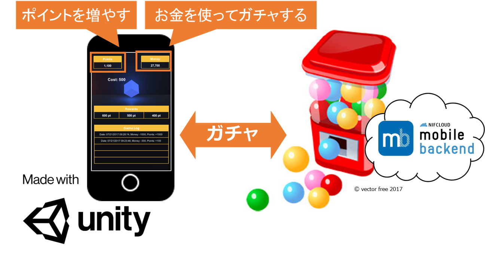
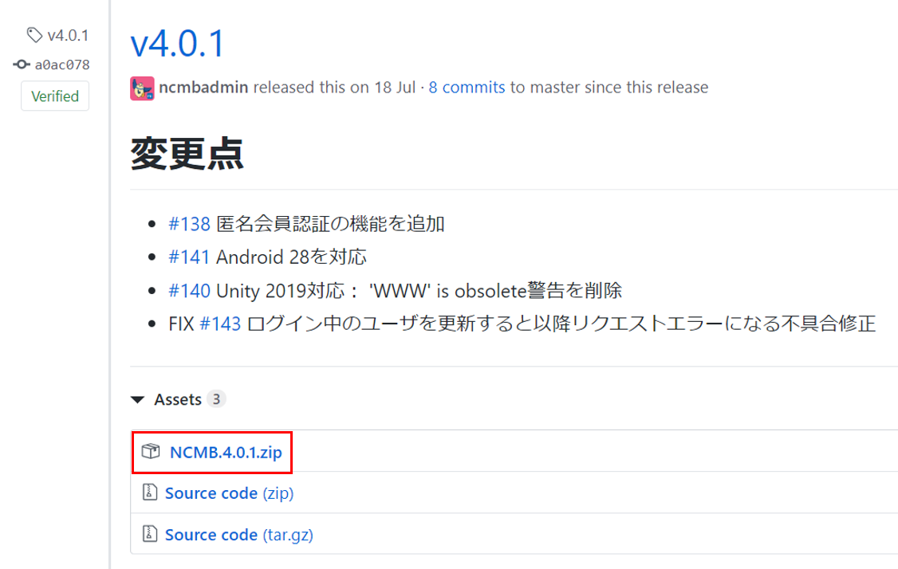
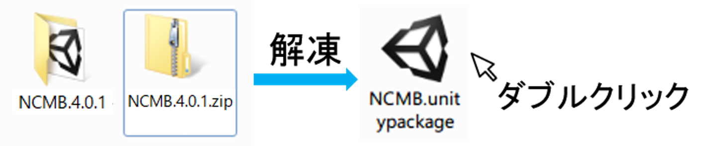
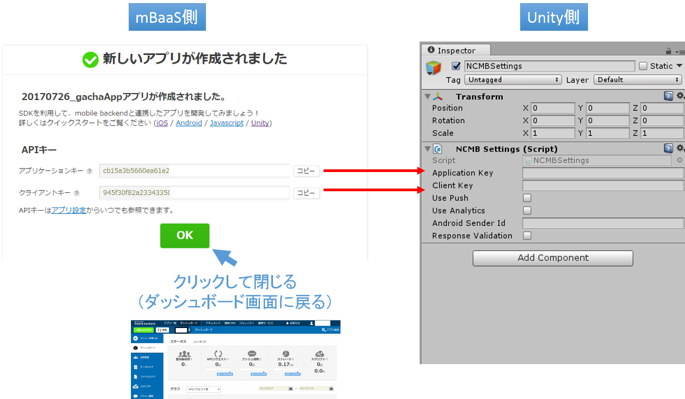
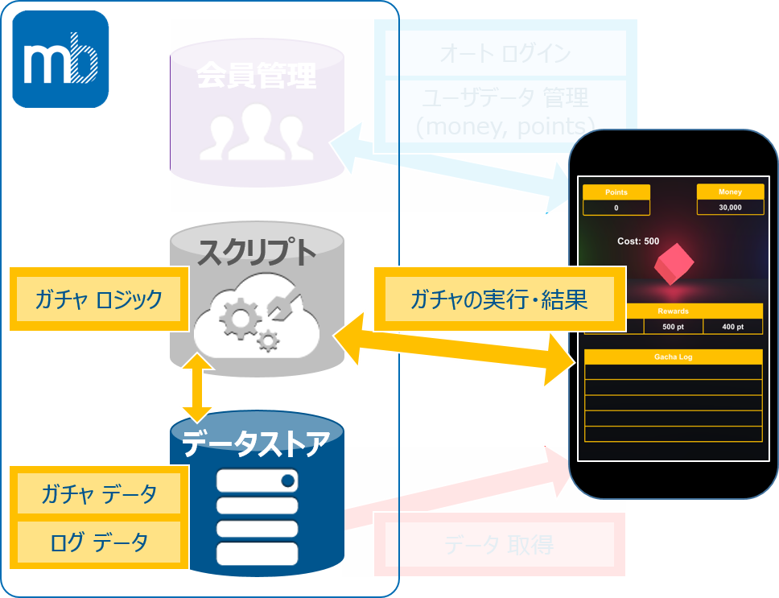

name: inverse
layout: true
class: center, middle, inverse

---
# <span style="font-size: 60%">【Unityハンズオン】</span>
# <span style="font-size: 70%">サーバーレスでゲームに<br>ガチャ機能を実装してみよう！</span>

@ 富士通クラウドテクノロジーズ 株式会社

.footnote[
 20170726作成
]
---
layout: true
class: center, middle, inverse
---
# はじめに

---
layout: false

### 概要
* ニフクラ mobile backendの『スクリプト機能』を利用して<br>
__`サーバーレスでガチャ機能を実装します`__
* サーバーレスとは?<br> __`サーバーを用意する必要なく`__ 、アプリ機能を作成できるということです

.center[]

---
### [ニフクラ mobile backend](http://mbaas.nifcloud.com/about.htm) って何？
* スマートフォンアプリに必要なバックエンド機能が __`開発不要で利用できる`__ クラウドサービス
* クラウド上に用意された機能を __`APIを呼び出すだけで利用できます`__
* __`無料`__で体験頂けます
* APIを利用するためのSDKは幅広く対応します (Swift / iOS / Android / JavaScript / Monaca / Unity)
* mobile Backend as a Service の頭文字を取って、通称 __`mBaaS`__ 呼ばれます

.center[]

---
### 本日の学ぶ内容
お金（`money`）を使って、ガチャを回し、ポイント（`point`）を獲得する簡単なデモゲームアプリを作ります
* __`会員管理機能`__を使って実装された__`オートログイン機能`__について説明します
* __`データストア機能`__ と __`スクリプト機能`__を使ってアプリに__`ガチャ機能`__を実装します

.center[]

---
### 事前準備
* [ニフクラ mobile backend (mBaaS)](http://mbaas.nifcloud.com/signup.htm)の利用登録（無料）
* テキストエディタお持ちでない方はご準備をお願いします
<br>_Atomエディターはこちらから_ https://atom.io/

### 動作環境準備
* PC: Windows 7 以上 (またはmacOS)
* Unity 5.6.2f1 以上

---
### ハンズオンの流れ
.size_large[
1.  __ハンズオンの準備__
    - Unityの準備
    - mBaaSの準備
1. __オートログイン機能の説明【実装済み】__
    - 動作確認
    - 動作フローの説明
    - コードの解説
1. __ガチャ機能の作成__
    - データストアの準備
    - スクリプトでの実装
    - Unityでの実装
    - 動作確認
1. __ログ機能の作成__
    - スクリプトでの実装
    - 動作確認
    ]
---
layout: true
class: center, middle, inverse
---
# ハンズオンの準備

---
layout: false
### 【Unityの準備】プロジェクトのダウンロード
* 以下のURLをクリックしてUnityプロジェクトをダウンロードします
<br>.size_large[https://github.com/NIFCloud-mbaas/UnityScriptApp/archive/master.zip]
* ダウンロードしたZipファイルを解凍します
* 解凍した __`UnityScriptApp-master`__ フォルダには以下の2つのサブフォルダがあることを確認してます
    - __`Unity Project`__:  作業対象のプロジェクト本体
    - __`Node.js`__         :  ガチャ機能のロジックを実装したファイル

.center[]

---
### 【Unityの準備】プロジェクトのインポート
* Unityを起動します
1. プロジェクト選択画面で右上の__`Open`__ボタンをクリックします
2. フォルダの選択画面で__`UnityProject`__フォルダを開きます

.center[]

---
### 【Unityの準備】プロジェクトの確認
1. __`Project`__タブで以下のように__`gacha`__シーンを開きます
2. __`Game`__タブにシーンがプレビューされることを確認します
* ここまで作業対象のUnityプロジェクトのインポートが完了しました

.center[]

---
### 【mBaaSの準備】UnitySDKのダウンロード
* mBaaSの機能(API)を利用するためにUnity用のSDKをインポートする必要があります
* 以下のURLをクリックしてSDKのダウンロードページを開きます
<br>.size_large[https://github.com/NIFCloud-mbaas/ncmb_unity/releases]
* __`Downloads`__欄にある __`NCMB.4.0.1.zip`__ ファイルをクリックしダウンロードします

.center[]

---
### 【mBaaSの準備】UnitySDKのインポート
* ダウンロードしたSDKの__`NCMB.4.0.1.zip`__ を解凍します
* できたフォルダの中にある__`NCMB.unitypackage`__ファイルをダブルクリックするとUnityのインポート画面が出てきます

.center[]

---
### 【mBaaSの準備】UnitySDKのインポート
* Unityのインポート画面では__`import`__ボタンをクリックし、インポートします
* __`Project`__タブに__`NCMB`__フォルダが生成されたことを確認します
* ここまででmBaaSのUnitySDKのインポートが完了しました

.center[]

---
### 【mBaaSの準備】UnitySDKにAPIキーを設定する準備
* __`Hierarchy`__タブの__`Create`__ボタンをクリックし、__`Create Empty`__を選択します
* __`GameObject`__というオブジェクトが作成されます

.center[]

---
### 【mBaaSの準備】UnitySDKにAPIキーを設定する準備
* __`GameObject`__オブジェクトを右クリックして__`rename`__を選択します
* 分かり易いように__`NCMBSettings`__にリネームします

.center[]

---
### 【mBaaSの準備】UnitySDKにAPIキーを設定する準備
* __`Project`__タブで __`Assets\NCMB\NCMBSettings.cs`__を確認します
* __`NCMBSettings.cs`__を先ほど作成した__`NCMBSettings`__オブジェクトにドラッグ＆ドロップして読み込みます

.center[]

---
### 【mBaaSの準備】UnitySDKにAPIキーを設定する準備
* __`NCMBSettings`__ オブジェクトをクリックして、__`Inspector`__ タブを開きます
* __`NCMBSettings`__ オブジェクトの__`Inspector`__ タブに __`NCMBSettings.cs(Script)`__コンポーネントが追加されていることを確認します

.center[]

---
### 【mBaaSの準備】UnitySDKにAPIキーを設定する準備
* __`NCMBSettings.cs(Script)`__ コンポーネントには以下の２つの入力欄があります
  + __`Aplication Key`__
  + __`Client Key`__
* 次にこの2つのAPIキーを作成します

.center[]

---
### 【mBaaSの準備】アプリAPIキーの作成

* [mBaaS](http://mb.cloud.nifty.com)のダッシュボードを開きます
* 画面の左上にある「新しいアプリ」ボタンをクリックし、新規作成画面を開きます
* アプリ名は __`20170726_gachaApp`__ とします
* `新規作成`ボタンをクリックしてアプリを作成します

.center[]

---
### 【mBaaSの準備】UnitySDKにアプリAPIキーを設定する
* APIキーの画面で`コピー`ボタンをクリックすると __`アプリケーションキー`__と__`クライアントキー`__をコピーすることができます
* Unity画面で __`NCMBSettings.cs(Script)`__コンポーネントの入力欄に、以下の2つのAPIキーをそれぞれ入力します
    - __Application Key__欄 : アプリケーションキー
    - __Client Key__欄 : クライアントキー

.center[]

---
layout: true
class: center, middle, inverse
---
# 2. オートログイン<br> .size_small_7[【実装済み】]

---
layout: false

### オートログイン機能
* オートログイン機能はmBaaSの会員管理機能を使います

.center[]

---
### 【オートログイン機能】オートログインとは?
* ユーザーにログイン操作を意識させずに会員情報を管理しログインを行う機能のこと

.center[]

---
### 【オートログイン機能】ユーザ登録の動作確認
* mBaaSとの連携ができた後は既にオートログイン機能が動作するようになっています
* Unity画面の__`再生ボタン`__をクリックすると、新規登録を行い、ログインした状態となります
* もう１度__`再生ボタン`__を押して、アプリを停止してください

.center[]

---
### 【オートログイン機能】ユーザ登録の動作確認
* __`Console`__タブで新規登録の動作を確認できます

.center[]

---
### 【オートログイン機能】ユーザ登録の動作確認
* mBaaSダッシュボードで会員管理画面を開きます
* 新規のレコードが１つ追加されていることが確認できます

.center[]


---
### 【オートログイン機能の解説】全体の動作フロー
* オートログイン機能は__`Assets\Scripts\AutoLogin.cs`__で実現されています

```cs
if(/*ユーザ情報が保存されていない*/){
    /* ユーザ登録処理 */
}else{
    // 現在ログインしているか
    if(NCMBUser.CurrentUser == null){
        /* ログイン処理 */
    }
}
```
.center[]

---
### 【オートログイン機能の解説】ユーザ登録
* mBaaSのUnity SDKの__`NCMBUser()`__ クラスを使ってユーザ情報を格納するための__`user`__オブジェクトを宣言します
`user`オブジェクトの`UserName`と`Password`フィールドと、属性情報として`points`と`money`フィールドに値を格納します
* __`user`__オブジェクトの__`SignUpAsync()`__メソッドを使って、格納した値を登録します

```cs
// ユーザ登録処理 （抜粋）
NCMBUser user = new NCMBUser();
user.UserName = username; // ユーザネーム
user.Password = password; // パスワード
user.Add("points", initialPoints); // 初期ポイント
user.Add("money", initialMoney); // 初期所持金
user.SignUpAsync((NCMBException e) => {
    if(e != null){
        // エラー処理
    }else{
        // 成功処理
    }
});
```
---
### 【オートログイン機能の解説】ログイン
* 端末がユーザ情報を持っている場合ではUnity SDKの__`NCMBUser`__オブジェクトの<br>
__`LogInAsync()`__メソッドで簡単にログインできます

```cs
// ログイン処理 （抜粋）
NCMBUser.LogInAsync(userName, password, (NCMBException e)=>{
    if(e != null){
        // エラー処理
    }else{
        // 成功処理
    }
});
```

---
layout: true
class: center, middle, inverse

---
# 3.ガチャ機能の作成

---
layout: false
### システム全体 - ガチャ機能部
* ガチャ機能はスクリプト、データストア機能を使います

.center[]

---
### ガチャ機能部 詳細
* ガチャの処理の流れです

.center[]

---
### データストア: ガチャアイテムを管理するクラス
* まずはガチャのデータをデータストアに作成します

.center[]

---
### データストア: ガチャアイテムを管理するクラス
* ガチャアイテムを管理する__`Gacha`__クラスをデータストアに作成し、ガチャアイテムをいくつか登録します
* 今回は、ダッシュボードのインポート機能を使います
    + ダッシュボードでデータストア画面を開きます
    + 「作成」ボタンをクリックします
    + 「インポート」を選択します
    + 「クラス名」に`Gacha`と入力します
    + 「ファイルを選択」をクリックします

.center[]

---
### データストア: ガチャアイテムを管理するクラス
* __`UnityScriptApp\UnityProject\GachaItems.json`__を選択します
* 「インポート」をクリックします

.center[]

---
### データストア: Gachaクラス確認
* __`Gacha`__クラスが作成されたことを確認します
* データストアのクラスには、デフォルトでいくつかのフィールド(列)が生成されます
    + objectId: 各レコードで重複しない文字列
* `Gacha`クラスには以下の３つのフィールドが追加してあります
    + cost: ガチャを回すのに必要なお金(数値)
    + rewards: ガチャを回して得られる可能性のある報酬３種類(配列、サイズ３)
    + probability: 各報酬が得られる確率（配列、サイズ２）

.center[]

---
### 例）1行目のレコード
* 1行目のガチャアイテムは、
    + 1000円(cost)払ってガチャを回すと
    + 10000ポイント、1000ポイント、0ポイントが
    + それぞれ、10％、10％、80％ の確率で選択されます

.center[]

---
### ガチャオブジェクトの確認１
* `Gacha`クラスを作成した後、Unityで__再生ボタン__をクリックします
* ゲーム画面にキューブオブジェクトが表示されるようになっています
* 画面を右方向にフリックしていく
    + 緑 → 赤 → 青と３種類のオブジェクトが確認できます
    + 各オブジェクトは、`Gacha`クラスの３つのアイテムに対応しています
    + UI にもガチャアイテムの情報が表示されています

.center[]

---
### ガチャオブジェクトの確認２
* キューブオブジェクトをクリックすると、キューブの回転速度が変化します
* 数秒後にガチャ結果ポップアップウィンドウが表示されます
* 今はまだスクリプト関連の処理が実装されていないので、お金もポイントも変化はありません

.center[]

---
### ガチャオブジェクトの確認３
*　"Assets\Scripts\GachaCubeGenerator.cs"に以下の処理が実装されています
  + データストアからガチャアイテムを取得し
  + キューブオブジェクトを作成する
    - 興味のある方はご参照ください

.center[]

---
### 【スクリプトでの実装】ガチャロジックの実装
* スクリプトでガチャロジックを実行する処理を実装します

.center[]
1. ガチャIDに一致するガチャアイテムをデータストアから取得
2. ガチャから得られる３種類の報酬から１つを確率に従って選択
3. ガチャの結果をアプリへと返却

---
### 【スクリプトでの実装】実装内容
* "UnityScriptApp\Node.js\gacha.js"をエディタで開いてください

.center[]

---
### 【スクリプトでの実装】1. ガチャアイテムをデータストアより取得①
* ① まず、mBaaSの機能（データストア機能）を使う準備をします
    + NCMBの機能を読み込み
    + APIキーを設定し
    + NCMBオブジェクトを初期化します

```js
module.exports = function(req, res)
{
    //--------------------------------------------------------------
    // 1. ガチャIDに一致するガチャのデータをデータストアから取得する
    //--------------------------------------------------------------
    // ① mBaaSの機能を使う準備をする
    /* ここから コピペ */
    var NCMB = require('ncmb');
    const APL_KEY = "アプリケーション キー";
    const CLI_KEY = "クライアント キー";
    var ncmb = new NCMB(APL_KEY, CLI_KEY);
    /* ここまで コピペ */
}
```

---
### APIキーの設定
```cs
// 再掲
const APL_KEY = "アプリケーション キー";
const CLI_KEY = "クライアント キー";
```

.center[]

---
### 【スクリプトでの実装】1. ガチャアイテムをデータストアより取得②
* ② アプリからクエリとして受け取ったガチャID（gachaId）の確認をします
    + もしgachaIdに何も入ってなければエラーを返します

```js
// ② アプリから受け取ったガチャID(gachaId)を確認
var gachaId = req.query.gachaId;
if(gachaId == null){
    // ガチャIDがない → エラー処理
    res.status(400)
       .json({"message":"BadRequest (No gachaId)"});
}
```

---
### 【スクリプトでの実装】1. ガチャアイテムをデータストアより取得③
* ③ データストアの"Gacha"クラスに接続し、gachaIdに一致するものを取得します

```js
// ③ データストアの "Gacha"クラスに接続しgachaIdに一致するものを取得
var gachaClass = ncmb.DataStore("Gacha");
gachaClass.equalTo("objectId", gachaId)
    .fetchAll()
    .then(function(results){
        // 成功処理
        /* 次のステップで実装 */
    })
    .catch(function(err){
        // 失敗処理
        res.status(500).json({error: 500})
    });
```

---
### 【スクリプトでの実装】1. ガチャアイテムをデータストアより取得③
* gachaIdに一致するガチャアイテムがなかった場合、エラー処理をしておきます

```js
.then(function(results){
    // 成功処理
    /* ここから コピペ */
    if(results.length == 0){
        res.status(404)
           .json({"message":"NotFound (Confirm objectId)"});
    }
    //--------------------------------------------------------------
    // 2. ガチャから得られる３種類の報酬から１つを確率に従って選択
    //--------------------------------------------------------------
    /* 次のステップで実装 */

    //--------------------------------------------------------------
    // 3. ガチャの結果をアプリへ返す(JSON形式)
    //--------------------------------------------------------------
    /* 次の次のステップで実装 */

    //--------------------------------------------------------------
    // 4. ガチャの結果が得られたらそのログを保存する
    //--------------------------------------------------------------
    /* ログ部分に関しては後で時間があれば実装 */

    /* ここまで コピペ */
})
```

---
### 【スクリプトでの実装】2. ３種類の報酬から１つを選択
* データストアから該当のガチャアイテムが得られました(results[0])ので
* 報酬３種類(rewards)から１つを確率（probability)に従い選択する処理を実装します

```js
//--------------------------------------------------------------
// 2. ガチャから得られる３種類の報酬から１つを確率に従って選択
//--------------------------------------------------------------
rewardNum = selectReward(results[0].probability);
if(rewardNum == -1){
    res.status(500)
        .json({"message":"Probability must be defined as Array(length=2)"});
}
```
* selectReward(Array) 関数は、
    + 各報酬の確率の配列を引数として受け取り、
    + 報酬の配列の index（0, 1, 2 のいずれか）を確率に従って返します
    + 引数が確率の配列でなかった場合は -1 を返し、エラー処理を行います

---
### 【スクリプトでの実装】3. ガチャの結果をアプリへ返す
* 最後に、ガチャロジックでの計算結果をアプリ側へと返します

```js
//--------------------------------------------------------------
// 3. ガチャの結果をアプリへ返す（JSON形式）
//--------------------------------------------------------------
var moneyDiff = -results[0].cost;
var pointDiff = results[0].rewards[rewardNum];
res.status(200)
    .json({"moneyDiff":moneyDiff,
           "pointDiff":pointDiff});
```

---
### gacha.jsファイルのアップロード
* gacha.jsファイルの実装が完了したので、mBaaSサーバーへアップロードします
    + ダッシュボードからスクリプト設定画面を開きます
    + 「アップロード」ボタンをクリックします
        - 「ファイルを選択」から、gacha.jsを選択します

.center[]

---
### gacha.jsファイルのアップロード
* gacha.jsを選択すると新しい設定項目が増えます
    + メソッドを"GET"とします
    + ファイルの状態を"実行可能"とします
    + 「アップロードする」 をクリックします

.center[]
* ※ スクリプト管理画面で試しに実行してみることができます
* が、クエリを指定していないとエラーが出ます

---
### 【Unityでの実装】スクリプト実行処理の実装
* ここまでの実装で、スクリプトの準備はできました
* アプリからスクリプトを呼び出し、ガチャ結果を受け取る部分の実装をしていきます

.center[]

---
### 【Unityでの実装】スクリプト実行処理の実装
* "Assets\Scripts\GachaCubeClick.cs"をエディタで開きます
    + キューブがクリックされた際の処理が記述されています

.center[]

---
### 【Unityでの実装】スクリプト実行処理の実装
* キューブをクリックした際にスクリプトが実行されるように、以下のメソッド(139行目)を実装していきます

```cs
private IEnumerator executeScriptCoroutine(string gachaId, NCMBObject currUser)
{
    // (1) スクリプトからのレスポンスを格納するメンバ変数の初期化

    // (2) NCMBScriptクラスのインスタンスを生成する

    // (3) スクリプトに渡すクエリを設定する

    // (4) スクリプトを実行する

    // (5) スクリプト処理終了まで待機する
    yield return null;
}
```
---
### 【Unityでの実装】(1) スクリプトからのレスポンスを格納するメンバ変数の初期化
* スクリプトからはJSON形式でレスポンスが返ってきます
* これらを格納するためのメンバ変数"scriptResponse"を初期化しておきます
```cs
// (1) スクリプトからのレスポンスを格納するメンバ変数の初期化
scriptResponse.pointDiff = 0;
scriptResponse.moneyDiff = 0;
```

---
### 【Unityでの実装】(1) スクリプトからのレスポンスを格納するメンバ変数の初期化
* メンバ変数"scriptResponse" は以下の構造体により定義されています
* JSON形式のレスポンスをパースするための構造体です

```cs
// スクリプトからのJSON形式のレスポンスを受け取るための構造体
public struct ScriptResponse
{
    // ポイントの変化量
    public int pointDiff;
    // お金の変化量
    public int moneyDiff;
}
```

---
### 【Unityでの実装】(2) NCMBScriptクラスのインスタンスを生成する
* スクリプトを実行する準備をします
* 第一引数は、先ほど作成してアップロードしたファイル名です
* 第二引数は、リクエストのタイプです

```cs
// (2) NCMBScriptクラスのインスタンスを生成する
NCMBScript gachaLogicScript = new NCMBScript("gacha.js", NCMBScript.MethodType.GET);
```

---
### 【Unityでの実装】(3) スクリプトに渡すクエリを設定する
* 先ほど実装したスクリプトでは、ガチャIDをクエリとして受け取って処理を行っています
    + クエリは、"Dictionary"クラスとして定義します

```cs
// (3) スクリプトに渡すクエリを設定する
Dictionary<string, object> query = new Dictionary<string, object> (){
                                                {"gachaId", gachaId},
                                                {"userId", currUser.ObjectId} };
```

---
### 【Unityでの実装】(4) スクリプトを実行する
* 以下のメソッドでスクリプトが実行されます

```cs
// (4) スクリプトを実行する
gachaLogicScript.ExecuteAsync(null, null, query, (byte[] result, NCMBException e) => {
    if(e != null){
        // スクリプト実行失敗(エラー表示)
        Debug.Log(e.ErrorCode +":"+ e.ErrorMessage);
    }else{
        // スクリプト実行成功(JSONをパースして "scriptResponse" に格納)
        string resultStr = System.Text.Encoding.ASCII.GetString(result);
        scriptResponse = JsonUtility.FromJson<ScriptResponse>(resultStr);
    }
});
```
* `NCMBScript.ExecuteAsync()`は、
    + mBaaSスクリプトサーバーに、指定したファイルの実行をリクエストします
    + 引数は(header, body, query, callbackFunction) です

---
### 【Unityでの実装】(5) スクリプト処理が終了するまで待機する
* `NCMBScript.ExecuteAsync()` は、非同期処理です
* このメソッドの終了を待たずに処理は先へと進んでいきます
* 先にUIのテキスト更新の処理などが走ってしまう...

```cs
bool isCalculating = true;  // ← この行を追加
// (4) スクリプトを実行する
gachaLogicScript.ExecuteAsync(null, null, query, (byte[] result, NCMBException e) => {
    if(e != null){
        /*省略*/
    }else{
        /*省略*/
    }
    isCalculating = false;  // ← この行を追加
});
// (5) スクリプト処理終了まで待機する
yield return new WaitWhile(()=>{return isCalculating;});    // ← この行を変更
```

---
### 【Unityでの実装】動作確認
* ここまでで以下のフローが完成しました
    1. ガチャキューブをクリックしたら
    1. クリックしたガチャキューブのガチャIDをスクリプトに投げる
    1. スクリプトがロジックを実行し、結果がアプリに返る
* Unity画面で再生ボタンをクリックします
* ガチャキューブをクリックします
* ガチャ結果が表示されます
* OKボタンをクリックすると、UIテキストに結果が反映されます

---
### いったん完成
.center[]


---

layout: true
class: center, middle, inverse
---
# ログ機能の作成 <br>（時間があれば）


---
layout: false
### 【スクリプトでの実装】ログ機能を追加実装
* 不正やエラーを追うためにもログがあると便利です
.center[]

---
### 【スクリプトでの実装】データストア接続準備
* gacha.jsを書き換えてログの保存機能を付け加えます
* データストアにログを保存する準備をします

```js
//--------------------------------------------------------------
// 4. ガチャの結果が得られたらそのログを保存する
//--------------------------------------------------------------
// userIdを確認
var userId = req.query.userId;
if(userId == null){
    // ユーザIDが渡されていない
    res.status(400)
       .json({"message":"BadRequest (No userId)"});
}

// "GachaLog"クラスのインスタンスを生成
var GachaLogClass = ncmb.DataStore("GachaLog");
var gachaLogClass = new GachaLogClass();
```

---
### 【スクリプトでの実装】データストアにログを保存
* ログの保存を実行します
```js
// ログ保存を実行
gachaLogClass.set("moneyDiff", moneyDiff)
             .set("pointDiff", pointDiff)
             .set("userId", userId)
             .save()
             .then(function(gachaLogClass){
                 //成功処理
                 /* 次のステップで実装 */
             })
             .catch(function(err){
                 //失敗処理
                 /* 次の次のステップで実装 */
             });
```
---
### 【スクリプトでの実装】成功処理
```cs
.then(function(gachaLogClass){
    // 成功処理
    /* ここから */
    res.status(200)
       .json({"moneyDiff":moneyDiff,
              "pointDiff":pointDiff});
    /* ここまで */
})
```
---
### 【スクリプトでの実装】失敗処理
```js
.catch(function(err){
    // 失敗処理
    /* 以下の１行をコピペ */
    res.status(500).json({"message":"Failed to save log"});
});
```
---
### 【スクリプトでの実装】ログ実装前のレスポンス部分を削除
* ログの保存前に、レスポンスを返す部分があるので削除します
```js
//--------------------------------------------------------------
// 3. ガチャの結果をアプリへ返す（JSON形式）
//--------------------------------------------------------------
var moneyDiff = -results[0].cost;
var pointDiff = results[0].rewards[rewardNum];
/* ここから */
res.status(200)
   .json({"moneyDiff":moneyDiff,
          "pointDiff":pointDiff});
/* ここまで 削除orコメントアウト */
```

---
### gacha.js の再アップロード
* ダッシュボードのスクリプト管理画面を開いてください
* 「一覧」の中の「gacha.js」をクリックします（チェックではないです）
* 右上の「変更」ボタンをクリックします
.center[]

---
### gacha.js の再アップロード
* ファイル本体の変更で、「変更する」を選択します
    + 新しい設定項目が表示されます
* ログ機能実装後の「gacha.js」を選択します
* 「変更する」をクリックします
.center[]

---
### 完成
.center[]

---
layout: true
class: center, middle, inverse
---
# おわりに

---
layout: false

### 学んだ内容
* mBaaSのUnity SDKの設定方法
* mBaaSの会員管理機能、データストア機能とスクリプト機能の使い方
* オートログインの仕組み
* サーバーレスでガチャ機能を実装する方法

---
### 今後の展望
* ユーザ情報をスクリプト機能サーバー上で管理する
  - よりセキュアなシステムを実現できる
.center[]

---
layout: true
class: center, middle, inverse
---
# ぜひmBaaSで快適な<br>プログラミングライフを<br>お送りください!
